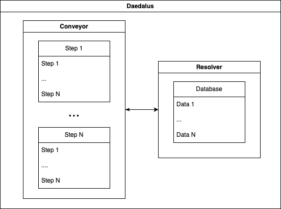

# Daedalus

Daedalus is the pipeline framework you've always been looking for.

## Fast start with examples

1. [Basic usage](examples/basic/)
2. [Verbosity levels](examples/verbosity_levels/main.go)
3. [Multiple stages](examples/multiple_stages/)
4. [Multiple steps](examples/multiple_steps/)
5. [Delete stage](example/delete_stage)
6. [Delete step](example/delete_step)
7. [Share data between steps](examples/share_data_between_steps/)
8. [Run steps as goroutines](examples/run_steps_as_goroutines/)

## Description

Daedalus has the necessary key tools to help you create the pipeline of your dreams.

Daedalus is a facade class to create, build, and run pipelines. You can (and should) access this class.

Conveyor part:

- Conveyor is an orchestrator class that actually builds and runs pipelines. You can't access it.
- Stage is a container class that is used to store and execute steps. It also collects statistics during execution. When you create a stage, you get its iID and can use it to manage the stage through Daedalus. Stage can execute steps consequently or concurrently (using goroutines).
- Step is an interface class. You must implement it with a desired procedure, the required input data names, and the output data names. Conveyor will automatically pass all the input data you've requested and will expect all the output data you've declared.

Resolver part:

- Resolver is a driver class that is used to get and push data to the pipeline's database. You can't access it.
- Data is an interface class. Each implemention must have its own unique name.
